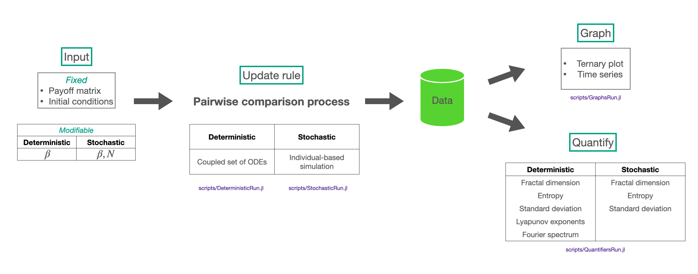
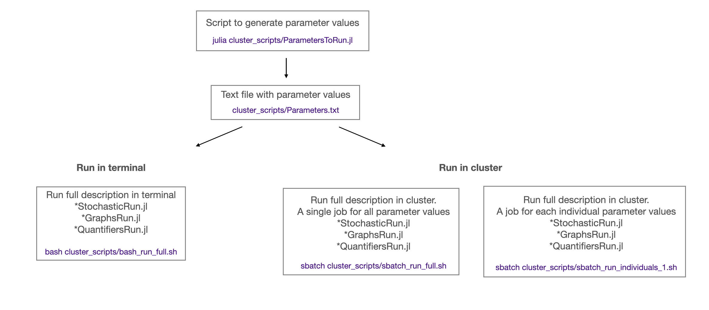

# ChaosNoiseEGT

Code of the paper

***Chaos and noise: disorder in population dynamics* by M.A.Ramirez, ... & A. Traulsen**

See the published paper here:.----

## Overview

The code allows the evolution of a system using the pairwise comparison process.
Given any payoff matrix defined in `src/PayoffMatrix.jl`, the system can be evolved through a deterministic or a stochastic approach.


*Interactive notebooks*
To explore the dynamics of different parameters values, run the code via the interactive notebooks:
* Deterministic approach
* Stochastic approach

## Code outline

### 1. Deterministic approach
The deterministic approach is based on solving a set of differential equations (see eqs paper).
The main parameter of this approach is the selection intensity coefficient (`B`).

-To solve the set of equations and obtain the data: `julia scripts/DeterministicRun.jl B`

-To graph the data (ternary plot and timeseries): `julia scripts/GraphsRun.jl B`

-To measure the quantifiers used to characterise the dynamics: `julia scripts/QuantifiersRun.jl B`

### 2. Stochastic approach
The stochastic approach is based on simulating the stochastic process.
The main parameters of this approach are the selection intensity coefficient (`B`) and the population size (`N`).

-To simulate the process and obtain the data: `julia scripts/StochasticRun.jl B N`

-To graph the data (ternary plot and timeseries): `julia scripts/GraphsRun.jl B N`

-To measure the quantifiers used to characterise the dynamics: `julia scripts/QuantifiersRun.jl B N`

#### 2.1 Cluster runs

To get an accurate interpretation of the stochastic simulation results, it is required to run several runs.

-To set the parameters to be explored: `julia cluster_scripts/ParametersToRun.jl`

-To run the simulations in the cluster
   - Run all stochastic approach scripts in terminal: `bash bash_run_full.sh`
   - Submit stochastic approach batch scripts to Slurm (full process of 3 scripts for all parameters in `Parameters.txt`):  `sbatch sbatch_run_full.sh`
   - Submit individual stochastic approach batch scripts to Slurm (full process of 3 scripts for each parameter in `Parameters.txt`):  `sbatch sbatch_run_individuals_1.sh`

-To obtain the main statistical measures of the quantifiers results: `julia clusterdata_scripts/ManageClusterData.jl`

-To graph the quantifiers results: `julia clusterdata_scripts/GraphClusterData.jl`

-------
## Reproducibility
This code base is using the Julia Language and [DrWatson](https://juliadynamics.github.io/DrWatson.jl/stable/)
to make a reproducible scientific project named
> ChaosNoiseEGT

It is authored by Maria Alejandra Ramirez.

To (locally) reproduce this project, do the following:

0. Download this code base. Notice that raw data are typically not included in the
   git-history and may need to be downloaded independently.
1. Open a Julia console and do:
   ```
   julia> using Pkg
   julia> Pkg.add("DrWatson") # install globally, for using `quickactivate`
   julia> Pkg.activate("path/to/this/project")
   julia> Pkg.instantiate()
   ```

This will install all necessary packages for you to be able to run the scripts and
everything should work out of the box, including correctly finding local paths.

_Note: to graph the ternary plots it is required to download the python package [mpltern](https://mpltern.readthedocs.io/en/latest/installation.html)_

_To import the Python package `mpltern` via `pyimport`, open the Julia console and do:_
   ```
   julia> using Conda
   julia> Conda.add("mpltern")
   ```
2. Run the `FolderStructure.sh` file to create the folders that store data and plots
   ```
   ChaosNoiseEGT$ bash FolderStructure.sh
   ```

```
   .
   ├── ...
   ├── plots                        # plot files (pdf format)
   │   ├── Deterministic
   │   |    ├── FractalDimDet       #Fractal dimension plots
   │   |    ├── TernaryDet          #Ternary plots
   │   |    └── TimeseriesDet       #Time series plots
   │   ├── Stochastic
   │   |    ├── FractalDimSto       #Fractal dimension plots
   │   |    ├── TernarySto          #Ternary plots
   │   |    └── TimeseriesSto       #Time series plots   
   │   └── GeneralQuantifiers
   ├── ...
   ├── data                          # data files (txt or csv format)
   │   ├── Deterministic 
   │   ├── Stochastic
   │   └── Quantifiers
   │        ├── QuantifiersDet       #Deterministic quantifiers
   │        ├── QuantifiersSto       #Stochastic quantifiers
   │        └── ClusterQuantifiers   #Cluster data quanifiers (stochastic runs)
   └── ...
```